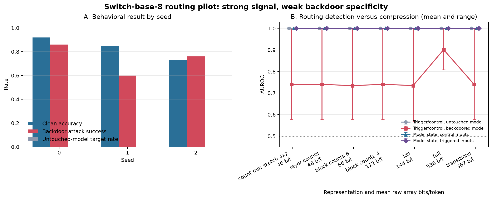

# Routing-Trace Backdoor Detection

This repository studies whether privacy-preserving summaries of Mixture-of-Experts
(MoE) routing behavior can detect model backdoors, and whether an adaptive attacker
can camouflage those routing signatures.

The initial experiment uses a small Switch Transformer on a text-classification
task. It measures the tradeoff between monitor bandwidth, backdoor detection, and
privacy leakage without collecting prompts or raw GPU memory addresses.

See the [experiment design](docs/experiment-design.md) for the research questions,
threat model, evaluation protocol, and scope.

## Current milestone

The repository currently provides the model-independent experiment core:

- compact, prompt-free routing records;
- Switch Transformer encoder hooks with padding and capacity-drop handling;
- full, ID-only, block-count, layer-count, transition, and count-min-sketch views;
- raw array-buffer accounting in bits per token;
- a differentiable routing-camouflage loss;
- group-disjoint detector evaluation; and
- deterministic poisoned-pair construction.

The included synthetic experiment is a pipeline smoke test, not research evidence.
It confirms that collection, compression, and evaluation work before model weights
are downloaded.

The real-model pilot trains a binary head and selected Switch router classifiers,
then evaluates four controls: activation within the untouched model, activation
within the backdoored model, model state on control inputs, and model state on
triggered inputs. Clean and triggered samples use equal-length neutral suffixes so
sequence length cannot identify the condition.

## Three-seed pilot result

The first real-model run used an RTX 5080, `google/switch-base-8` pinned at model
revision `92fe2d22b024d9937146fe097ba3d3a7ba146e1b`, 200 generated training
examples, 100 held-out examples, and seeds 0–2.



| Metric | Mean | Seed range |
| --- | ---: | ---: |
| Backdoored-model clean accuracy | 0.83 | 0.73–0.92 |
| Backdoor attack success rate | 0.74 | 0.60–0.86 |
| Untouched-model target rate | 0.00 | 0.00–0.00 |
| Backdoor activation AUROC, layer counts (~46 raw bits/token) | 0.74 | 0.58–1.00 |
| Untouched-model trigger/control AUROC, layer counts | 1.00 | 1.00–1.00 |
| Model-state AUROC on control inputs, layer counts | 1.00 | 1.00–1.00 |

The compressed traces retain a strong signal, but this pilot does **not** establish
backdoor-specific detection. The untouched model perfectly separated the generated
trigger and control inputs, and the router-fine-tuned model was perfectly separable
from the untouched model even on control inputs. The current result is therefore
evidence for routing-trace detectability, with weak specificity: the detector may
be identifying the input template or broad model changes rather than the implanted
backdoor. A less synthetic dataset and a benign fine-tuning control are the next
tests needed for the research hypothesis.

The plotted aggregate and seed-level values are available in the
[machine-readable pilot summary](docs/results/pilot-summary.json). To regenerate
both public report files from the ignored raw run artifacts:

```powershell
python scripts/plot_pilot_results.py --results-dir artifacts/pilot/results
```

## Quick start

The core uses Python 3.10 or newer. From the repository root:

```powershell
python -m pip install -e ".[dev]"
routing-monitor demo --pairs 100 --output results/demo.json
python -m pytest
```

The demo emits one row per compression level with raw array bits per token, AUROC,
average precision, and true-positive rate at 1% false-positive rate.

## Storage-conscious real pilot

The pilot keeps the Hugging Face cache and its result JSON under one ignored
artifact directory. The default storage guard is 4 GiB:

```powershell
python -m pip install -e ".[experiment]"
routing-monitor pilot --artifact-dir artifacts/pilot --max-storage-gb 4
```

It uses `google/switch-base-8`, 200 generated training examples, 100 held-out
examples, and one seed by default. The generated task is intentionally small: its
result is a feasibility measurement, not a publication-ready backdoor benchmark.
Run multiple seeds before interpreting the routing controls.

## Capturing Switch routing

Install the optional experiment dependencies with the CUDA-enabled PyTorch build
appropriate for your machine, then install this project:

```powershell
python -m pip install -e ".[experiment]"
```

`routing_monitor.collection.collect_switch_dataset` accepts an already loaded
Hugging Face Switch Transformer, its tokenizer, and records containing opaque
`id` and `text` fields. It writes compact NumPy traces and a manifest containing
only sample IDs, filenames, token counts, raw array sizes, and stored file sizes.
Prompt text and token IDs are never written to telemetry artifacts.

```python
from transformers import AutoTokenizer, SwitchTransformersForConditionalGeneration

from routing_monitor.collection import collect_switch_dataset

model_name = "google/switch-base-8"
model = SwitchTransformersForConditionalGeneration.from_pretrained(model_name).to("cuda")
tokenizer = AutoTokenizer.from_pretrained(model_name)

collect_switch_dataset(
    model,
    tokenizer,
    [{"id": "sample-0001", "text": "example input"}],
    output_dir="artifacts/routes",
    batch_size=1,
    max_length=128,
    device="cuda",
)
```

Downloaded weights, datasets, checkpoints, traces, and generated results are
ignored by Git by default.

## Privacy boundary

This project records logical expert routing, not raw GPU memory addresses. Logical
hooks are a white-box research oracle and are not presented as equivalent to
passive hardware telemetry. That mapping is a separate future experiment.
